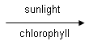
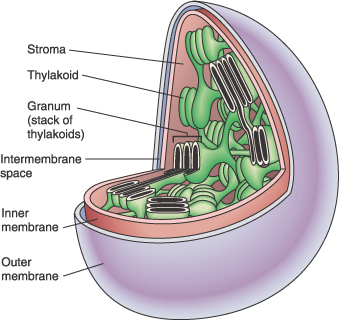
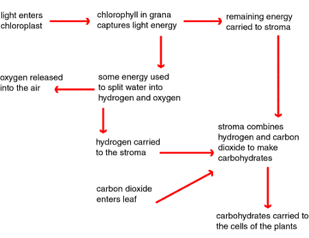

# MoodMuse: Revolutionizing Mental Wellness

---

## Introduction to MoodMuse
- **Name Origin**: Combination of "Mood" + "Muse"
- **Logo**: Stylized open book with a musical note and heart
- **Primary Color**: Soft Lavender (calmness & creativity)

---

## Mission Statement
- **Empower Individuals**: Understand emotions through journaling
- **AI Analysis**: Summarize journal entries & mood tracking
- **Music Recommendations**: Tailored to user emotions

---

## Market Opportunity
- **Global Mental Wellness Market**: Projected to reach $121 billion by 2027
- **Journaling Statistics**: 70% of Americans use journaling for mental health benefits

---

## User Engagement Features
- **Submit Journal Entries**: For summaries and mood tracking
- **Personalized Music Suggestions**: Based on emotional analysis
- **Technology Stack**: NLP algorithms, music API integration

---

## User Growth Projections
- **Year 1 Goal**: 10,000 active users
- **Freemium Model**: Premium subscription at $9.99/month

---

## Addressing User Privacy
- **Data Encryption**: Robust measures to protect sensitive information
- **Compliance**: Adherence to GDPR and CCPA regulations

---

## Company Culture & Team
- **Founding Team**: Emily Chen (CEO), David Patel (CTO)
- **Culture**: Empathy, innovation, transparency
- **Work Environment**: Flexible arrangements, open workspaces

---

## Sustainability Goals
- **Carbon Neutrality**: Achieve by 2030
- **Reduce E-Waste**: Target a 40% reduction by 2025
- **Community Engagement**: Fund mental health programs in underserved communities

---

## Technology Development Plan
- **MVP Development**: Allocate $50,000 for core functionalities
- **Market Research**: Conduct surveys with at least 100 participants

---

## Competitive Analysis
- **Current Competitors**: Daylio, Reflectly, Journey
- **Unique Selling Proposition**: Combination of sentiment analysis & music recommendations

---

## Revenue Projections
- **Year 1 Revenue**: Estimated at $1,233,000
- **Freemium Model**: Basic, Premium, and Professional tiers

---

## User Journey Flow
1. **Sign Up**
2. **Submit Journal Entries**
3. **Receive Summaries & Recommendations**

---

## Conclusion
- **Impact on Mental Health**: Innovative solutions for emotional understanding
- **Future Goals**: Expand user base to 1 million by 2026

---

## Thank You!
- **Get in Touch**: [Contact Information]
- **Follow Us** on Social Media

---

## Image References
  
*The logo of MoodMuse representing calmness and creativity.*  

  
*The molecular structure of chlorophyll, essential for capturing sunlight, akin to how MoodMuse captures emotional insights.*  

  
*The chloroplast structure illustrating essential components for photosynthesis, paralleling the complex components of MoodMuse.*  

  
*A flowchart of photosynthesis stages, symbolizing the transformation of emotions through MoodMuse.*  
