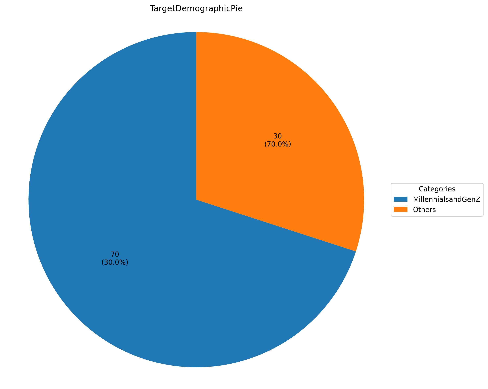
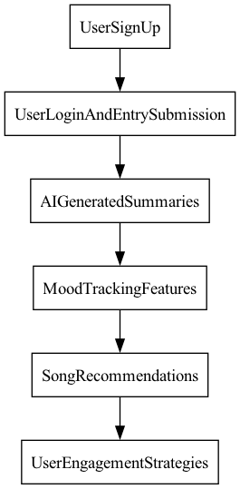
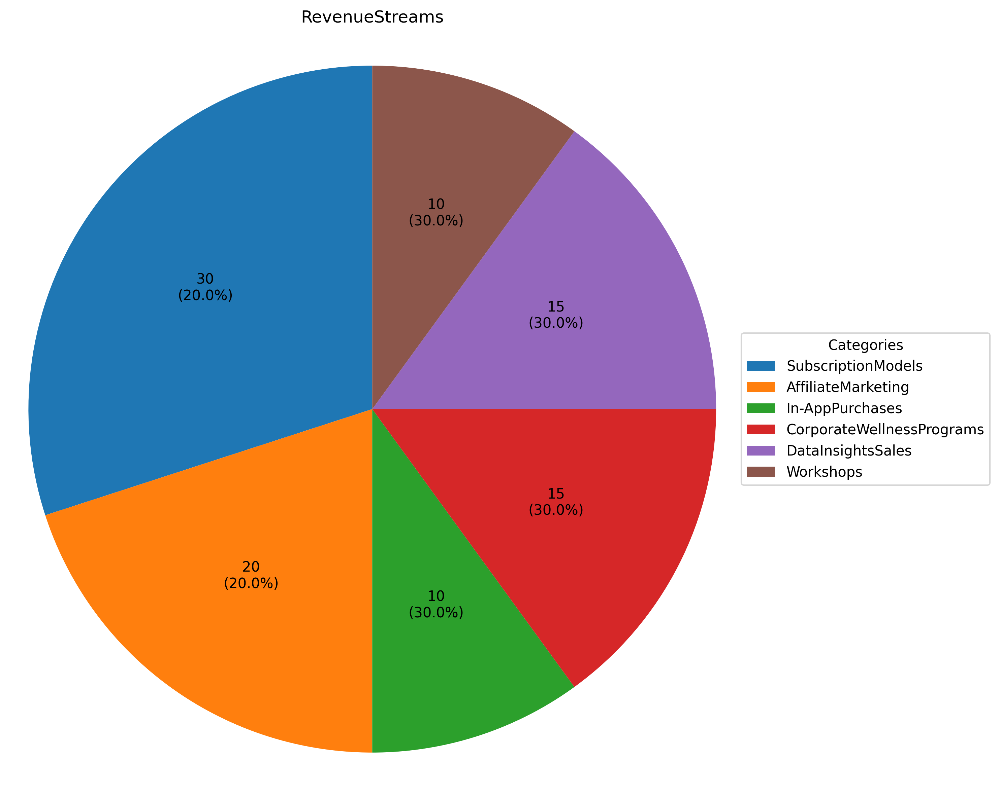
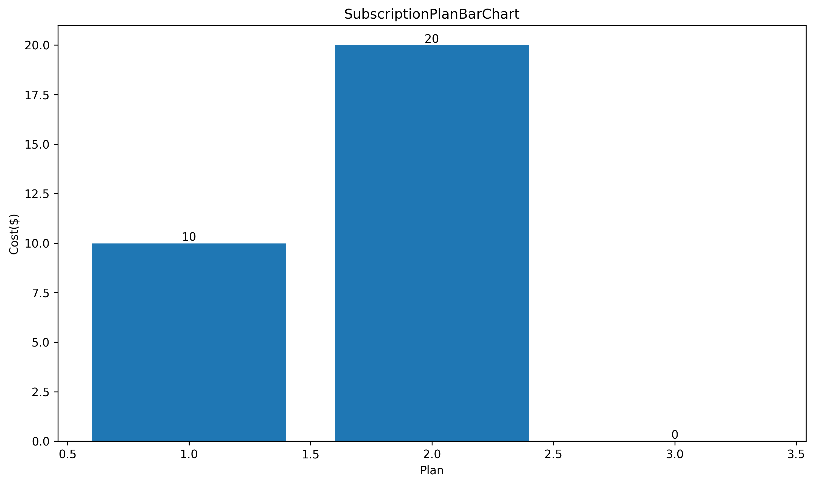
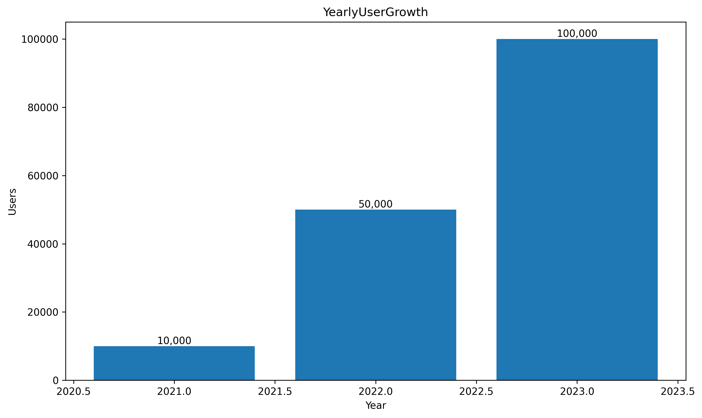

## Introduction to JournalAI  
- AI-driven journaling platform  
- Features include:  
  - Journal entry submission  
  - AI summarization  
  - Sentiment analysis  
  - Mood tracking  
  - Personalized song recommendations  

---

## Market Opportunity  
- Mental health app market projected to reach **$4.2 billion by 2027**  
- **30%** of the population journals for personal growth  
- Growing demand for self-improvement tools  

  
<!-- A comparison bar chart representing the projected growth of the mental health app market from 2021 to 2026, highlighting the market opportunity for the AI-driven journaling platform. -->  

---

## Target Audience  
- Individuals seeking self-improvement  
- Mental health professionals  
- Music enthusiasts  

  
<!-- This pie chart shows the distribution of the target demographic for the AI-powered journaling platform, focusing on Millennials and Gen Z who represent 70% of users and are more inclined to use digital journaling tools for mental wellness. -->  

---

## Key Functionalities  
- AI-powered summarization of journal entries  
- Mood tracking through visualizations (graphs, heat maps)  
- Song recommendations based on sentiment analysis  

  
<!-- A flowchart depicting the user journey on the AI-powered journaling platform, from signing up to engaging with mood tracking and song recommendation features. -->  

---

## Technical Architecture  
- **Frontend**: React.js / Vue.js  
- **Backend**: Node.js with Express.js  
- **Database**: MongoDB for flexible document storage  
- **AI Services**: NLTK / spaCy for NLP; Hugging Face's Transformers for summarization  

---

## Security Measures  
- User data encrypted with **AES-256**  
- **SSL** implemented for secure data transmission  
- Compliance with **GDPR** and **HIPAA** for data protection  

---

## Financial Projections  
- Year 1: **$1.5 million** revenue target  
- Year 2: Increase to **$2.7 million**  
- Year 3: Targeting **$5 million** revenue  

  
<!-- This pie chart illustrates the various revenue streams for the startup, highlighting the diversity in income sources ranging from subscription models to workshops. -->  

---

## Customer Acquisition Strategy  
- Freemium model to attract users  
- Subscription plans ranging from **$9.99 to $19.99/month**  
- Partnerships with mental health organizations  

  
<!-- This bar chart shows the pricing structure for the subscription plans available in the freemium model, detailing the cost difference between basic and premium options. -->  

---

## User Engagement Metrics  
- Targeting **100,000 active users** in Year 1  
- **Retention rate** of **70%** after six months  
- Average of **3 journal entries per week** per user  

  
<!-- This bar chart depicts the projected user growth of MoodMuse in each year starting from its initial launch. -->  

---

## Challenges and Solutions  
- **User Retention**: Implement gamification strategies  
- **Data Privacy Concerns**: Transparent privacy policies and robust encryption  
- **Market Competition**: Unique AI capabilities and features  

---

## Conclusion  
- JournalAI stands at the intersection of technology and mental health  
- Aimed at enhancing self-reflection and emotional awareness  
- Join us in transforming the journaling experience!  

---