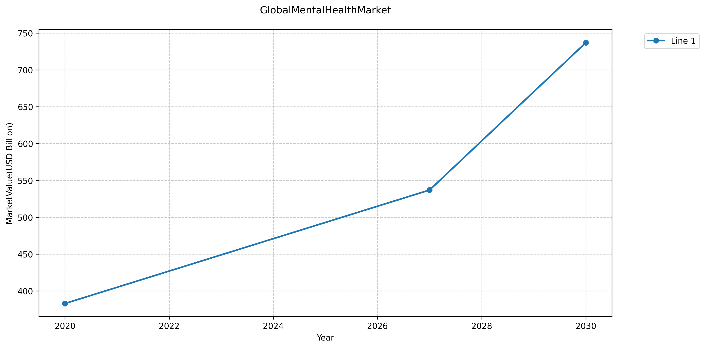
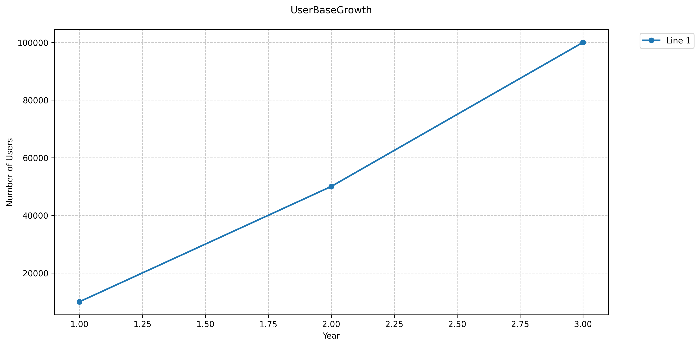
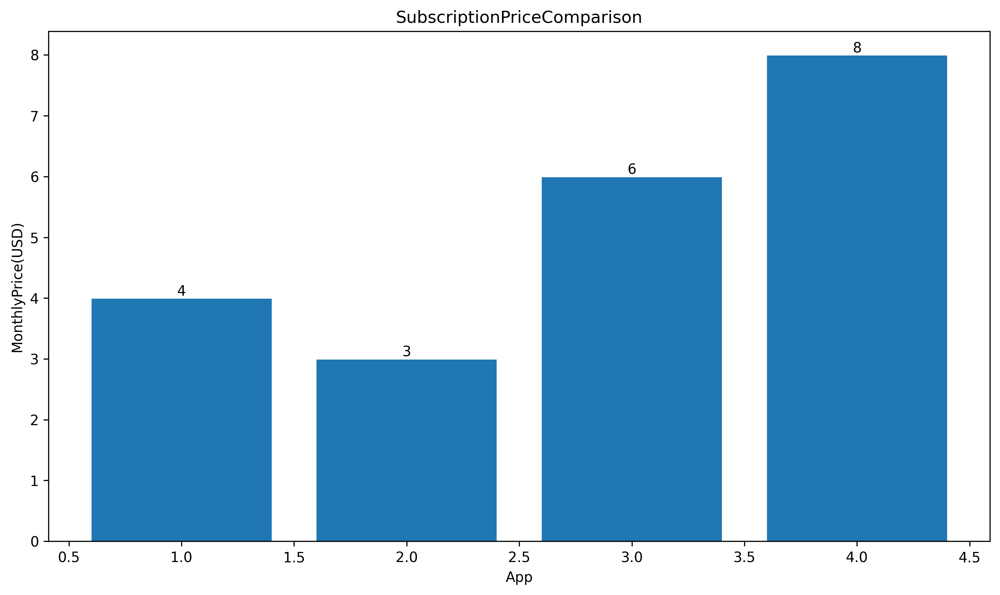
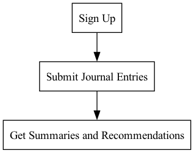
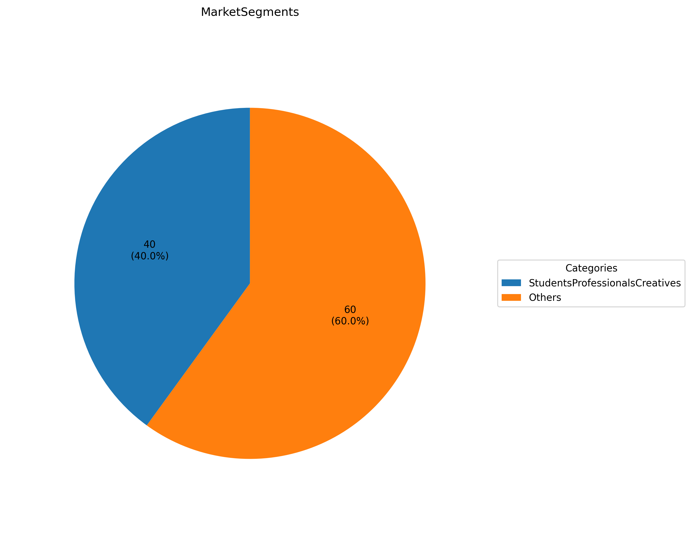
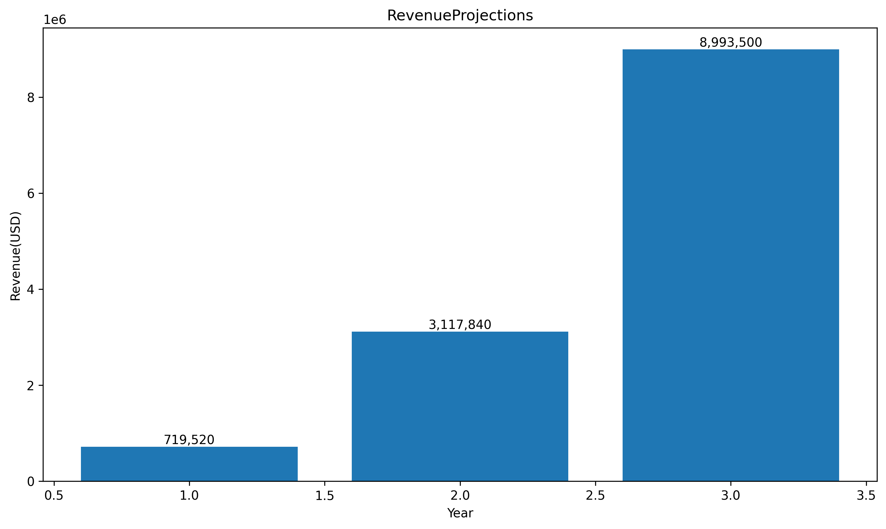

# Sales Pitch: MoodMuse

- MoodMuse combines "mood" and "muse" for emotional empowerment.
- Focus on journaling, AI analysis, and music recommendations.
- Logo features an open book with a musical note and heart shape.

---

# The Vision

- **Mission**: Empower individuals to understand their emotions.
- **Core Features**:
  - Journaling for self-reflection.
  - AI sentiment analysis.
  - Personalized music recommendations.

---

# Market Opportunity

- Global mental wellness market projected to reach **$121 billion** by 2027.
- 70% of Americans use journaling for mental health benefits.
- **CAGR**: 7.8% growth expected.

  

---

# User Engagement

- Users submit journal entries for:
  - Summaries.
  - Mood tracking.
  - Music recommendations.
- Aiming for **10,000 active users** in Year 1.

  

---

# Technology Stack

- Utilizing NLP algorithms for sentiment analysis.
- Integrating music APIs for personalized recommendations.
- Focus on data privacy and encryption compliance.

---

# Business Model

- **Freemium Model**:
  - Basic features for free.
  - Premium subscription at **$9.99/month**.
- Additional professional tier for mental health professionals.

  

---

# Founding Team

- **Emily Chen**: CEO with tech and mental health experience.
- **David Patel**: CTO, expert in AI technologies.
- Culture of empathy, innovation, and transparency.

---

# User Journey

1. Sign-up and onboarding.
2. Submit journal entries.
3. Receive AI-generated summaries and recommendations.

  

---

# Competitive Landscape

- Competitors include Daylio, Reflectly, and Journey.
- MoodMuse differentiates with AI-driven music integration.
- Focus on emotional insights and personalized recommendations.

---

# Marketing Strategy

- Target demographic: Individuals aged **18-35**.
- Digital marketing campaigns to acquire users.
- **KPIs**: CAC, LTV, and churn rates to assess growth.

  

---

# Financial Projections

- Targeting **5,000 premium subscribers** in Year 1.
- Projected revenue of **$400,000**.
- Annual growth of **30%** in subscriber base.

  

---

# Community Engagement

- Allocate **10% of profits** to mental health programs.
- Sustainability goals: Carbon neutrality by **2030**.
- Initiatives for supporting mental health awareness.

---

# Conclusion

- MoodMuse leverages technology to enhance emotional well-being.
- Positioned to capture a growing market in mental wellness.
- Join us in empowering individuals through innovative solutions.

---

# Thank You!

- Questions and discussions welcome!
- Contact details for further information.

