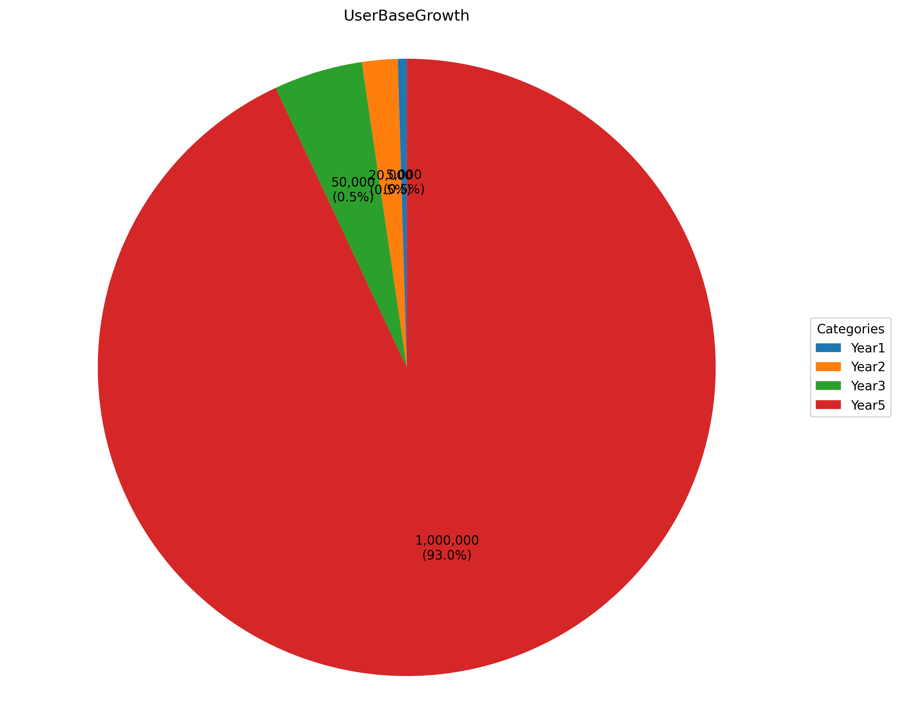
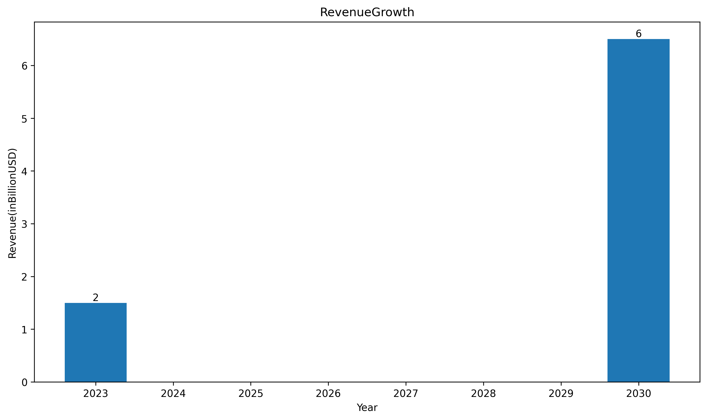
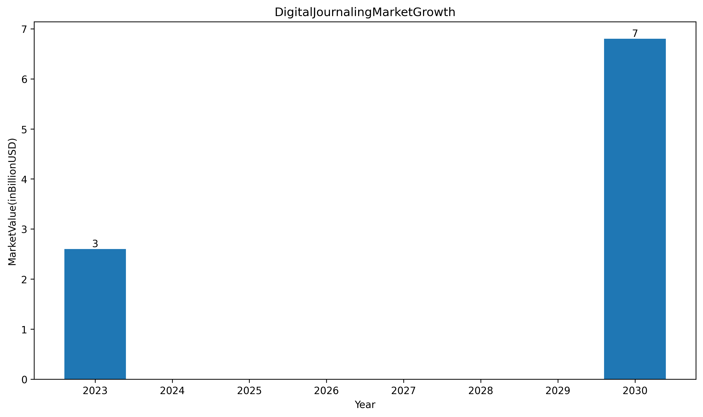
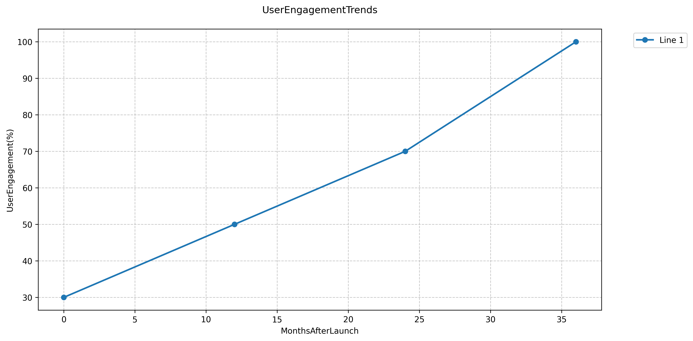
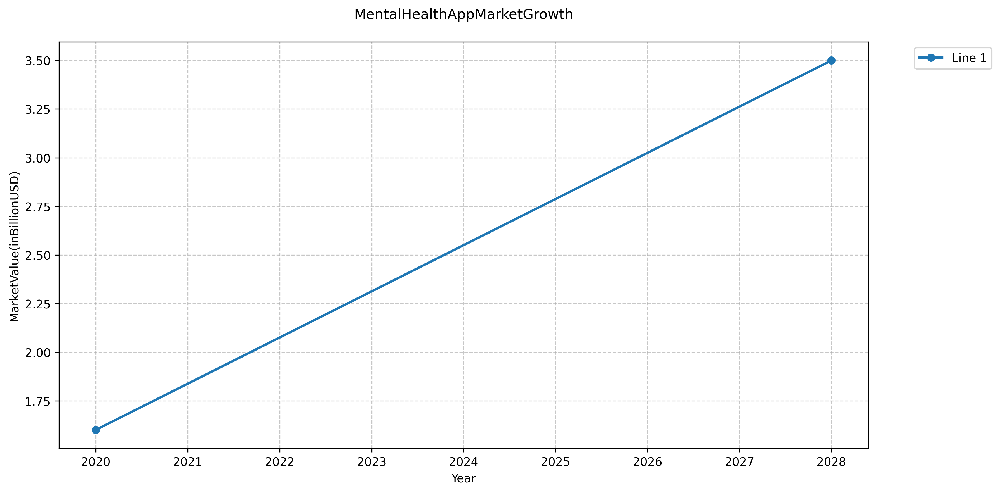
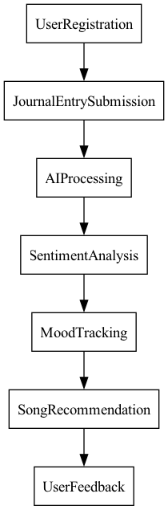

# Sales Pitch for JournalAI

---

## Introduction to JournalAI
- AI-driven journaling platform  
- Offers sentiment analysis, mood tracking, and personalized song recommendations  
- Targeting mental health enthusiasts and professionals  

---

## Business Model Overview
- **Revenue Streams**:  
  - Subscription plans ($9.99 - $19.99/month)  
  - Affiliate marketing  
  - In-app purchases  
  - Corporate wellness programs  
- **Initial Capital Requirement**:  
  - Estimated at $1.5 million  
  - Funding from angel investors and crowdfunding  

---

## Target Market
- **Demographics**:  
  - Young adults (ages 15-40)  
  - Individuals seeking mental wellness  
- **Market Size**:  
  - Digital mental health app market projected to reach **$4.2 billion by 2027**  
  - 30% of the population engages in journaling  

---

## Key Features of JournalAI
- User authentication and rich text editor  
- Visual mood tracker  
- AI summaries using NLP models (spaCy, BERT)  
- Music recommendations via Spotify API  

---

## Technical Architecture
- **Frontend**: React.js  
- **Backend**: Node.js with Express  
- **Database**: MongoDB for flexible storage  
- **AI Services**:  
  - NLP processing for entry analysis  
  - Sentiment analysis for emotional insights  

---

## Scalability and Security
- **Hosting**: Cloud services (AWS/Google Cloud) for scalability  
- **Data Security**:  
  - AES-256 encryption for user data  
  - OAuth 2.0 for secure authentication  

---

## User Engagement Strategies
- Content marketing to increase organic traffic (20% monthly)  
- Social media campaigns targeting younger audiences  
- Gamification strategies to enhance user retention (target churn rate < 5%)  

---

## Implementation Timeline
1. **Research and Development** (0-3 months)  
2. **Beta Launch** (4-6 months)  
3. **Full Launch** (6-12 months)  
4. **User Feedback and Enhancements**  

---

## Financial Projections
- Expected to reach **100,000 active users in 18 months**  
- Projected annual revenue of **$28 million by Year 3**  
- Customer acquisition cost (CAC) estimated at **$30/user**  

---

## Market Opportunities
- Growing demand for digital mental health solutions  
- Potential partnerships with mental health organizations  
- Opportunity to expand features based on user feedback  

---

## Conclusion
- JournalAI offers a unique blend of technology and mental wellness  
- Strong market potential and growth strategies in place  
- Join us in revolutionizing the journaling experience through AI!  

---

## User Base Growth Projection

---

## Revenue Growth Projection

---

## Digital Journaling Market Growth

---

## User Engagement Trends

---

## Mental Health App Market Growth

---

## User Journey Flow
